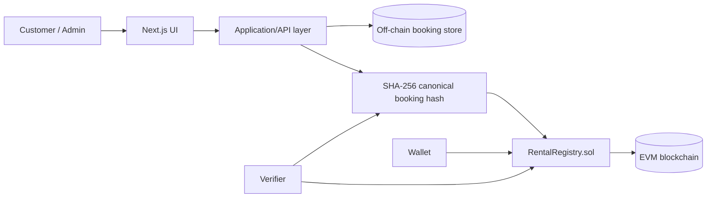

# RentChain

**Full-stack + blockchain portfolio project by Erica Nordlöf**

RentChain is a privacy-first rental workflow that demonstrates how traditional web application architecture can be combined with smart contracts without putting personal customer data on a public blockchain.

> Portfolio positioning: this is an **independent project** built to demonstrate applied blockchain development skills. It should not be described as proof of having completed a formal Blockchain Developer programme.

## Why this project exists

Rental businesses need operational speed, customer privacy and trustworthy records. A normal database is excellent for bookings but can be changed by an administrator. A public blockchain is excellent for immutable proofs but is a poor place for personal data.

RentChain separates those concerns:

1. Booking details stay off-chain.
2. A canonical booking payload is hashed with SHA-256.
3. Only the 32-byte hash is registered in the `RentalRegistry` smart contract.
4. Anyone with the original booking data can recompute the hash and verify integrity.
5. The contract also models a rental lifecycle and optional refundable deposit.

## Demo features

- Responsive portfolio-grade UI
- Create a rental booking
- Deterministic SHA-256 booking proof
- Demo mode that works without a wallet or deployed contract
- Optional MetaMask / EIP-1193 wallet connection
- Optional on-chain proof registration through `ethers.js`
- Proof verification page
- Rental lifecycle: Created → Active → Returned → Completed
- Solidity contract with role checks, duplicate-hash protection and reentrancy protection
- Hardhat automated tests
- GitHub Actions CI
- Docker configuration
- Architecture and security documentation

## Stack

- **Frontend:** Next.js, React, TypeScript
- **Validation:** Zod
- **Blockchain:** Solidity, ethers.js
- **Smart contract tooling:** Hardhat
- **Quality:** TypeScript strict mode, ESLint, contract tests, CI
- **Deployment:** Docker-compatible; frontend can be deployed to any Node-compatible platform

## Architecture



### Data boundary

**Off-chain:** names, contact details, dates, product information, operational notes.

**On-chain:** booking hash, wallet address, rental state, deposit amount, timestamps/events.

This approach demonstrates data minimization: blockchain is used as a trust layer rather than a replacement database.

## Smart contract design

`RentalRegistry.sol` implements:

- Unique booking proof registration
- Provider/customer roles
- Explicit state transitions
- Optional ETH deposit escrow
- Deposit return after completed rental
- Dispute state
- Custom Solidity errors
- Checks-effects-interactions
- Lightweight reentrancy guard

### Lifecycle

```text
Created -> Active -> Returned -> Completed
    \          \          \
     ----------- Disputed --
```

## Run locally

```bash
npm install
npm run dev
```

Open `http://localhost:3000`.

The app works immediately in **demo mode** using local browser storage.

## Run contract tests

```bash
npm run contract:compile
npm run contract:test
```

## Connect a real deployed contract

1. Deploy `contracts/RentalRegistry.sol` to an EVM-compatible test network.
2. Copy `.env.example` to `.env.local`.
3. Set:

```bash
NEXT_PUBLIC_RENTAL_REGISTRY_ADDRESS=0xYourContractAddress
NEXT_PUBLIC_CHAIN_ID=11155111
```

4. Restart the Next.js development server.
5. Connect an injected EIP-1193 wallet such as MetaMask.

Never commit private keys.

## Security decisions

See [SECURITY.md](./SECURITY.md).

Key principles:

- No personal customer data in smart-contract storage
- Duplicate booking hashes rejected
- Provider-only operational transitions
- State updated before value transfer
- Reentrancy protection around ETH release
- Input validation at API boundary
- Environment secrets excluded from Git

## Testing strategy

The smart-contract suite covers:

- Successful rental creation and deposit storage
- Duplicate hash rejection
- Full lifecycle and deposit return
- Unauthorized lifecycle transition rejection

Future production work would add browser E2E tests, API integration tests, contract fuzz/property tests and independent smart-contract security review.

## Portfolio talking points

When presenting this project, explain:

1. **Why not put booking data directly on-chain?** Privacy, cost and deletion requirements.
2. **Why store a hash?** It provides tamper evidence without publishing source data.
3. **Why a state machine?** It prevents invalid lifecycle transitions and makes business rules explicit.
4. **What would change in production?** Audited contracts, multisig provider administration, robust identity, database persistence, chain-indexing, observability and legal review.

## Suggested CV entry

**RentChain — Full-stack & Blockchain Portfolio Project**  
Developed a privacy-first rental platform concept using Next.js, TypeScript, Solidity, Hardhat and ethers.js. Implemented SHA-256 booking proofs, smart-contract lifecycle management, wallet integration, optional deposit escrow, automated contract tests, CI and security documentation. Designed the architecture to keep personal booking data off-chain while enabling independent integrity verification.

## Repository structure

```text
app/                 Next.js pages and API route
components/          Interactive client components
contracts/           Solidity smart contract
lib/                 Hashing, demo state and blockchain helpers
test/                Hardhat contract tests
.github/workflows/   CI pipeline
ARCHITECTURE.md       Design decisions and data flow
SECURITY.md           Threat model and security controls
```

## License

MIT. See `LICENSE`.
